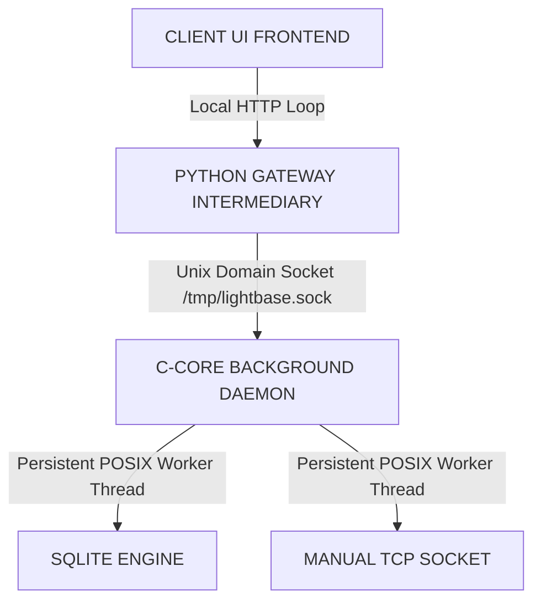

# 🚀 LightBase

**Ultra-performance, bare-metal local development runtime bridge and persistence engine built for high-compute applications.**

LightBase decouples heavy disk and outbound network I/O into a standalone, multi-threaded C background daemon, communicating asynchronously with an API gateway over high-speed Linux Unix Domain Sockets (UDS).

---

## 🏗️ Architecture Layout

LightBase eliminates high-level framework overhead, garbage collection cycles, and process-blocking runtime constraints by decoupling tasks into independent layer boundaries:



*   **Frontend UI Layer**: A lightweight development client executing async network operations back and forth.
*   **API Gateway Layer**: A zero-dependency Python routing engine acting as an IPC proxy gateway.
*   **Native Systems Core**: A high-speed, bare-metal C shared engine processing dynamic allocations, filesystem transactions, and socket forging loops on a detached POSIX background thread.

---

## 📂 Project Structure

```text
LightBase/
├── core/                # Native C Systems Core
│   ├── include/         # Header definitions (engine.h)
│   ├── src/             # Implementation (engine.c)
│   └── CMakeLists.txt   # Build configuration
├── bridge/              # Python IPC Gateway
│   ├── python_bridge.py # Intermediary routing engine
│   └── pyproject.toml   # Python dependencies
├── ui/                  # Web Interface
│   ├── index.html       # Frontend dashboard
│   └── index.js         # Async client logic
└── dist/                # Production assets (Generated)
    ├── lib/             # Compiled shared libraries (.so)
    └── include/         # Public header interfaces
```

---

## 🚀 Telemetry & Performance Benchmarks

By completely bypassing the local network routing stack and utilizing the Linux kernel to pipe raw bytes directly through memory spaces, LightBase delivers sub-millisecond core processing speeds:

*   **Local Database Transaction** (Multi-statement SQL Engine): `~990.20 us` ($< 1\text{ ms}$ bare-metal execution)
*   **Total IPC Roundtrip Gateway Latency**: `~1.203 ms` (Inclusive of Python decoding and HTTP transport)
*   **Outbound HTTP Network Socket Request** (`sys/socket.h`): Variable based on network geographical distance, wrapped with microsecond-accurate tracking hooks via `CLOCK_MONOTONIC`.

---

## 🛠️ Compilation & Installation Blueprint

### Prerequisites
Ensure your host machine runs a modern Linux kernel distribution equipped with `cmake`, `gcc`, and `uv` package utilities:

```bash
sudo apt update && sudo apt install cmake build-essential
```

### 1. Build the Production Core Library
LightBase employs an out-of-source CMake build pipeline configured with strict execution loop unrolling and Link-Time Optimizations (`-O3 -march=native -flto -s`):

```bash
cd core
mkdir -p build_release && cd build_release

# Configure release metrics and build the target layout
cmake -DCMAKE_BUILD_TYPE=Release ..
cmake --build . --target install
```

This automatically compiles and bundles clean, stripped development assets right into your centralized redistribution path:
*   **Header interface signature boundaries**: `dist/include/engine.h`
*   **Optimized shared binary library object**: `dist/lib/libcore.so`

### 2. Boot the Intermediary Python Gateway
LightBase uses the blazing-fast `uv` runtime engine to boot up environment dependencies and bring the IPC socket channel online:

```bash
cd ../../bridge
/usr/bin/uv run python python_bridge.py
```

Upon successful boot, the C-Core background worker thread instantly carves out a high-speed memory socket channel at `/tmp/lightbase.sock` and begins listening for downstream instructions.

---

## 🧠 Memory Design & Safety Assertions

LightBase maintains absolute memory safety across raw C boundaries by adhering to a defensive, length-capped layout framework:

*   **Dynamic Heap Expansion**: The database row callback uses an iterative `realloc()` doubling strategy, allowing rows to grow infinitely on the heap without hitting stack-bound truncation limits.
*   **String Sanitation Filters**: Inbound parameters pass through a single-pass linear sanitation pointer loop that flattens literal layout control flags (`\n`, `\t`, `\r`) into uniform space tokens before executing queries, completely preventing data corruption in high-level JSON parsers.
*   **Thread Race Protection**: Active server file descriptors pass explicitly into separate heap memory pools (`malloc`) at worker thread creation boundaries, fully isolating context pointers from stack invalidation faults.

---

## 📄 License

This project is licensed under the Apache 2.0 License [2026 Aarav Ravindra Kharade]

---

### 🧠 Memory Mistake Logging
> * **The Trap:** Leaving project README documentation incomplete or skipping clear directory structure architecture definitions, which forces other software engineers to dig through line-by-line code implementations just to find installation targets.
> * **Prevention:** Keep a production-ready `README.md` file updated at the root level, packed with explicit setup shell scripts, architecture flowmaps, and clear directory layouts.

