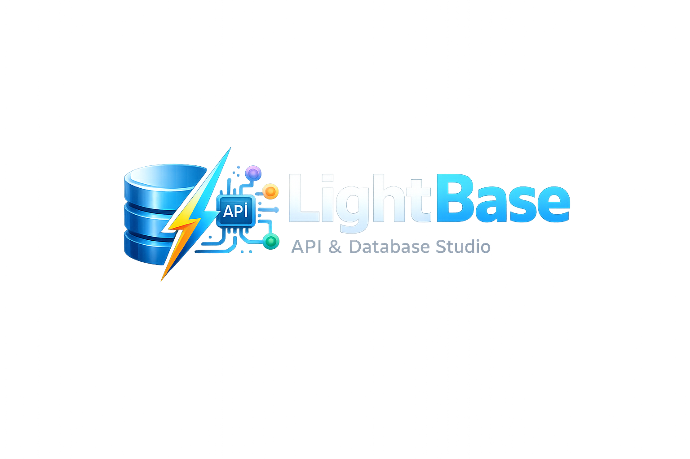

<p align="center">
  
</p>

<h1 align="center">⚡ LightBase</h1>

<p align="center">
  <b>A local-first, multi-protocol API development platform powered by a native C-Core engine with enterprise-grade security hardening.</b>
</p>

<p align="center">
  
  
  
  
  
</p>

LightBase is a zero-cloud API development studio that combines a high-performance C99 backend with a Python gateway bridge and a sleek browser-based UI. Every request, collection, and environment is stored as plain JSON files you can version-control with Git — no accounts, no cloud sync, no telemetry.

---

## ✨ Features

### Core Platform

| Feature | Description |
|---------|-------------|
| **Multi-Protocol API Studio** | REST, GraphQL, WebSocket, gRPC, MQTT — all in one tool |
| **Native C-Core Engine** | OpenSSL TLS, arena memory allocators, lock-free thread pool via Unix sockets |
| **SQL Console** | Execute queries against local SQLite with sub-millisecond C-Core latency |
| **Python Plugin System** | Write Python scripts with full PyPI access to process API responses |
| **Visual Flow Builder** | Chain requests, conditions, transforms, and AI blocks into automated workflows |
| **Live Data Streamer** | Real-time WebSocket and SSE streaming with message rate tracking |
| **AI Companion** | Local llama.cpp inference for test generation, request chaining, and response explanations |
| **Git-Reactive Engine** | Real-time `inotify`-based branch watcher with automatic hot-reload of schemas/configs |

### Security Hardening (C-Level)

| Feature | Description |
|---------|-------------|
| **HMAC-SHA256 Signing** | Sign and verify request payloads with constant-time comparison |
| **Token Bucket Rate Limiter** | 60-burst, 10/sec refill with FNV-1a client hashing |
| **IP Allowlist/Blocklist** | Block or allow specific IPs at the C level |
| **Session Token Manager** | Create, validate, and revoke tokens with configurable TTL |
| **Audit Trail Logger** | 500-entry circular buffer tracking all API operations |
| **Path Traversal Guard** | Blocks `..`, `~`, shell metacharacters, out-of-workspace paths |
| **SQL Injection Defense** | Blocks `ATTACH DATABASE`, `LOAD_EXTENSION`, and injection patterns |
| **Secure Memory Wipe** | Volatile zero-fill with memory barrier (compiler-proof) |
| **Request Size Limiter** | Configurable max payload size (default: 1MB) |
| **AES-256-GCM Crypto Vault** | Encrypted API key storage with post-operation key wiping |
| **`mlock()` Key Protection** | Signing keys locked in RAM — never swapped to disk |
| **`MADV_DONTDUMP`** | All key material excluded from core dumps |
| **`PR_SET_DUMPABLE(0)`** | Core dumps disabled process-wide via `prctl()` |
| **Machine-ID Key Derivation** | Master encryption key derived from `/etc/machine-id` + salt via SHA-256 |

### Enterprise Engine

| Feature | Description |
|---------|-------------|
| **Collection Runner** | Run entire collections with variable chaining, test execution, and iteration support |
| **Data-Driven Testing** | Upload CSV/JSON iteration data for parameterized test runs |
| **CI/CD Reports** | Generate JUnit XML (Jenkins/GitHub Actions) and styled HTML reports |
| **JSON Schema Validation** | Validate API responses against JSON Schema drafts |
| **Code Snippet Generator** | Auto-generate client code in cURL, Python, JavaScript, Java, Go, PHP |
| **Auth Handler** | OAuth 2.0, Bearer Token, Basic Auth, API Key — applied programmatically |
| **Workspace Sync** | Export/import entire workspaces with SHA-256 integrity checksums |
| **Collection Comments** | Leave review comments on API collections for team collaboration |
| **Collection Forking** | Fork collections with metadata tracking (like Git) |
| **Webhook Alerts** | Slack, Microsoft Teams, and generic webhook notifications |
| **HTML API Docs** | Auto-generate styled documentation portals from collections |
| **Jupyter & Python Export** | One-click export of history or collections to `.ipynb` or `.py` |

### 10 Power Features

| # | Feature | Description |
|---|---------|-------------|
| 1 | **LightBase Management API** | Programmatically CRUD your collections, environments, mocks, and history via REST endpoints (`/api/collections`, `/api/environments`, `/api/mocks`, `/api/history`) |
| 2 | **Built-in Echo Service** | Hit `localhost:8000/echo` to instantly mirror back your request method, headers, body, and query params — a zero-config sanity checker for debugging |
| 3 | **Response Visualizer** | Embed custom HTML/CSS/JS visualizations (Chart.js, D3.js, etc.) directly into the response pane using the built-in sandboxed iframe renderer |
| 4 | **Built-in Test Libraries** | Pre-request and test scripts have access to dynamic variables (`{{$timestamp}}`, `{{$guid}}`, `{{$randomInt}}`, `{{$randomEmail}}`), JSONPath extraction, and the full `lb.test()` / `lb.expect()` assertion API powered by embedded QuickJS |
| 5 | **Workflow Control (`setNextRequest`)** | Use `setNextRequest("name")` inside test scripts to skip, repeat, or reorder requests during collection runs — with infinite-loop protection |
| 6 | **Collaboration (Comments & Forking)** | Comment on collections, tag teammates, and fork collections with full metadata tracking (source, author, timestamp) — all stored as flat JSON in Git |
| 7 | **Collection-Level Scripts** | Define pre-request and test scripts at the collection level that run before/after *every* request in the collection (DRY principle) |
| 8 | **Scheduled Monitors** | Schedule collection runs at fixed intervals for continuous regression testing, with results saved as timestamped reports |
| 9 | **Built-in GraphQL Support** | Full GraphQL query editor with variables panel, dedicated endpoint routing, and schema-aware response rendering |
| 10 | **Webhook Triggers** | Trigger any collection run via a URL (`/webhook/trigger/<name>`) with custom payload injection — perfect for CI/CD pipelines and external integrations |

---

## 🏗️ Architecture

```
┌─────────────────┐     ┌──────────────────────────┐     ┌──────────────────────┐
│   Browser UI    │ ←→  │   Python Bridge            │ ←→  │   C-Core Engine      │
│  (HTML/CSS/JS)  │HTTP │   (ThreadingHTTPServer)    │ IPC │   (libcore.so)       │
│                 │     │                            │ UDS │                      │
│  • API Studio   │     │  • Route dispatcher        │     │  • OpenSSL TLS 1.3   │
│  • SQL Console  │     │  • Enterprise engine       │     │  • Lock-free pool    │
│  • Flow Builder │     │  • Plugin executor         │     │  • Security module   │
│  • Security Tab │     │  • Export engine            │     │  • mmap telemetry    │
│  • Dashboards   │     │  • Auth handler            │     │  • Git watcher       │
└─────────────────┘     └──────────────────────────┘     └──────────────────────┘
                               │                           │
                         ┌─────┴──────┐              /tmp/lightbase.sock
                         │ workspace/ │              (TLV binary protocol)
                         │  (Git-able)│
                         └────────────┘
```

### Layer Responsibilities

- **Native Desktop UI** — Lightweight HTML/CSS/JS client rendered in a native desktop window (via `pywebview`/WebKit2), featuring glassmorphism design, protocol tabs, security dashboard, and real-time displays.
- **Python Bridge** — Multi-threaded HTTP gateway (ThreadingHTTPServer on port 8000) that proxies requests to the C-Core, runs the enterprise engine, manages plugins, and spins up the PyWebView window natively.
- **C-Core (`libcore.so`)** — Lock-free multi-threaded native engine handling TLS networking, SQLite queries, telemetry logging, AES crypto, security hardening, Git reactive state, and AI inference via a binary TLV protocol over `/tmp/lightbase.sock`

---

## 🚀 Quick Start

### One-Line Install (clone → build → install)

```bash
git clone https://github.com/Aarav90-cpu/LightBase.git
cd LightBase
make install-deps    # Auto-detects your distro and installs packages
make                 # Build C-Core + install Python deps
sudo make install    # System-wide install (appears in app menu!)
```

After install, launch from your app menu or terminal:

```bash
lightbase
```

### Supported Distributions

| Family | Distros | Package Manager |
|--------|---------|-----------------|
| **Debian/Ubuntu** | Ubuntu, Debian, Linux Mint, Pop!_OS, Kali, Zorin | `apt` |
| **Red Hat/RPM** | Fedora, RHEL, AlmaLinux, Rocky Linux, CentOS | `dnf` |
| **Arch** | Arch Linux, Manjaro, EndeavourOS, Garuda | `pacman` |
| **openSUSE** | openSUSE Tumbleweed, Leap, SLES | `zypper` |

`make install-deps` automatically detects your distro and runs the correct package manager.

### Manual Steps (if you prefer)

```bash
# 1. Install system deps (pick your distro)
# Debian/Ubuntu:
sudo apt install cmake build-essential libssl-dev libsqlite3-dev libgit2-dev python3 python3-pip
# Fedora/RHEL:
sudo dnf install cmake gcc gcc-c++ openssl-devel sqlite-devel libgit2-devel python3 python3-pip
# Arch/Manjaro:
sudo pacman -S cmake base-devel openssl sqlite libgit2 python python-pip

# 2. Build
make

# 3. Run locally (without system install)
make run
```

### Make Targets

| Command | Description |
|---------|-------------|
| `make` | Build C-Core + install Python deps |
| `make install-deps` | Auto-detect distro, install system packages |
| `make build` | Build C-Core only |
| `make run` | Start the bridge server (port 8000) |
| `make test` | Run full test suite (75 tests, 24 categories) |
| `sudo make install` | System-wide install → app menu + `lightbase` command |
| `sudo make uninstall` | Remove system-wide install |
| `make clean` | Remove build artifacts, caches, logs |
| `make dist` | Create production distribution bundle |

### Boot Output

```
[C-Core Pool] Asynchronous Interceptor Grid deployed with 8 active threads!
[Security] 🔐 HMAC-SHA256 signing key initialized (mlock+dontdump).
[Bridge] 🛡️ Security module armed (HMAC + rate limiter + path guard + SQL sanitizer).
[Bridge] 🧠 Git reactive watcher armed.
[Bridge] LightBase API → http://localhost:8000 🚀
```

### 3. Open the UI

Open `ui/index.html` in your browser, or serve it locally:

```bash
cd ui && python3 -m http.server 3000
# → http://localhost:3000
```

### 4. Run Tests

```bash
make test     # Runs test_all.py (75 tests across 24 categories)
```

### 5. Clean Up

```bash
make clean    # Remove build artifacts, caches, logs, temp files
```

---

## 📂 Project Structure

```
LightBase/
├── core/                   # Native C99 engine
│   ├── include/            # Public headers (engine.h, storage.h, tlv.h)
│   ├── src/                # Source files
│   │   ├── engine.c        # HTTPS engine, IPC router, SQL executor
│   │   ├── storage.c       # mmap telemetry, schema scanner, env manager
│   │   ├── thread_pool.c   # Lock-free SPMC ring buffer (atomic CAS)
│   │   ├── security.c      # Security hardening (10 modules)
│   │   ├── crypto_vault.c  # AES-256-GCM key encryption
│   │   ├── git_watcher.c   # Reactive inotify-based Git state engine
│   │   ├── ai_core.c       # Local llama.cpp inference bridge
│   │   └── assert_engine.c # QuickJS test assertion runtime
│   └── build_release/      # Build artifacts (libcore.so)
├── bridge/
│   ├── python_bridge.py    # HTTP gateway + security routes + plugin runner
│   └── enterprise.py       # Enterprise engine (runner, reports, codegen, auth)
├── ui/
│   ├── index.html          # Main application shell (10 tabs)
│   ├── app.js              # Core logic (requests, env, tabs, tests)
│   ├── features.js         # Extended features (plugins, flows, AI, security)
│   └── style.css           # Glassmorphism design system
├── workspace/              # 100% local, Git-versionable storage
│   ├── collections/        # Saved API request configs
│   ├── environments/       # Variable sets (dev/staging/prod)
│   ├── plugins/            # Python plugin scripts
│   ├── flows/              # Visual workflow definitions
│   ├── history/            # Auto-logged request history
│   ├── monitors/           # Scheduled run configs & results
│   ├── reports/            # CI/CD test reports (JUnit XML, HTML)
│   ├── exports/            # Generated workspace packages
│   └── docs/               # Generated OpenAPI specs & HTML docs
├── docs/
│   └── user_guide.md       # Comprehensive user documentation
├── test_all.py             # Full test suite (75 tests, 24 categories)
├── Makefile                # Cross-distro build/install/test/clean
├── requirements.txt        # Python dependencies
├── assets/
│   ├── logo.png            # Project logo (used in README + app icon)
│   ├── icons/              # Icon sizes (16→512px) for desktop integration
│   ├── lightbase.desktop   # Freedesktop app launcher entry
│   └── lightbase-launcher.sh # System launcher script
└── dist/                   # Production distribution bundle
```

---

## 🛡️ Security API Reference

| Endpoint | Description |
|----------|-------------|
| `POST /security/status` | Full security module status report |
| `POST /security/sign` | HMAC-SHA256 sign a payload |
| `POST /security/verify` | Verify payload signature |
| `POST /security/validate_path` | Check path for traversal attacks |
| `POST /security/validate_sql` | Check SQL for injection patterns |
| `POST /security/ip/add` | Add IP allow/block rule |
| `POST /security/ip/remove` | Remove IP rule |
| `POST /security/ip/list` | List all IP rules |
| `POST /security/ip/check` | Check if IP is allowed |
| `POST /security/session/create` | Create session token with TTL |
| `POST /security/session/validate` | Validate session token |
| `POST /security/session/revoke` | Revoke session token |
| `POST /security/session/list` | List active sessions |
| `POST /security/audit/log` | Read audit trail |
| `POST /security/audit/clear` | Clear audit trail |
| `POST /security/max_size/set` | Set max request size |
| `POST /security/max_size/get` | Get max request size |

---

## 📊 Performance

LightBase delivers sub-millisecond core processing by bypassing the network stack entirely:

| Operation | Latency |
|-----------|---------|
| Local SQLite query (via arena allocator) | **~750 µs** |
| IPC roundtrip (Python ↔ C-Core) | **~1.2 ms** |
| Outbound HTTPS (OpenSSL TLS 1.3) | Variable, with µs-precision `CLOCK_MONOTONIC` tracking |
| Telemetry write (mmap ring buffer) | **< 10 µs** |
| Lock-free pool task dispatch (CAS) | **< 1 µs** |
| HMAC-SHA256 sign/verify | **< 50 µs** |

---

## 📖 Documentation

For complete feature documentation, usage guides, and API reference:

**→ [User Guide](docs/user_guide.md)**

Covers all features including API Studio protocols, test scripts, visual flows, plugin system, AI workflows, exports, security hardening, and enterprise engine.

---

## 🛠️ CLI Usage

Run headless requests without the UI:

```bash
# Via the included CLI script
./bridge/lb-cli.sh httpbin.org /get GET

# Or directly via curl
curl -X POST http://localhost:8000/request \
  -H "Content-Type: application/json" \
  -d '{"method":"GET","hostname":"httpbin.org","path":"/get","headers":[]}'
```

---

## 📄 License

Licensed under the [Apache License 2.0](LICENSE).

---

*Built with ⚡ — 100% local, zero cloud dependencies, enterprise-grade security.*
