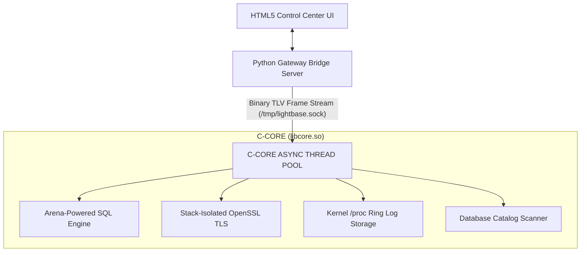

# 🚀 LightBase

**Ultra-performance, bare-metal local development runtime bridge and persistence engine built for high-compute applications.**

LightBase decouples heavy disk and outbound network I/O into a standalone, multi-threaded C background daemon, communicating asynchronously with an API gateway over high-speed Linux Unix Domain Sockets (UDS).

---

## 🏗️ Architecture Layout

LightBase eliminates high-level framework overhead, garbage collection cycles, and process-blocking runtime constraints by decoupling tasks into independent layer boundaries.



### Layer Responsibilities
*   **Frontend UI Layer**: A lightweight development client executing async network operations back and forth.
*   **API Gateway Layer**: A zero-dependency Python routing engine acting as an IPC proxy gateway.
*   **Native Systems Core**: A high-speed, bare-metal C shared engine processing dynamic allocations, filesystem transactions, and socket forging loops on detached POSIX background threads.

---

## 🚀 Core Studio Module Suite

### 🌐 Module 1: Bare-Metal Environment Manager
Tracks application environments (Development, Staging, and Production) dynamically inside isolated runtime boundaries.
*   **Atomic Remapping Swaps**: Eliminates sluggish filesystem configuration lookups by pre-allocating an `EnvironmentBlock` structure directly within a dedicated `MemoryArena`. Context switches occur in under 1μs via thread-safe atomic pointer reassignments.
*   **Fallback Safety Paths**: System state transitions are fully guarded against uninitialized pointer exceptions, ensuring backup file parameters handle initial transaction states safely.

### 🧪 Module 2: Cryptographic API Testing Studio
Provides bare-metal HTTP engine request assembly and transaction benchmarking.
*   **Target Mu: Interactive Custom Header Grid Matrix**: A dynamic row-cloning grid matrix using pure vanilla DOM elements for high memory efficiency. Compiled custom auth keys or content typings are streamed directly down the Python-C pipeline.
*   **Target Nu: Interactive JSON Request Body Payload Console Pane**: A high-capacity request payload text block area for building heavy-duty `POST` or `PUT` payloads.
*   **Wire Packet Serialization**: Leverages stack-allocated sequence spaces to assemble raw wire payloads (GET, POST, PUT, DELETE) with exact specification alignment.
*   **TLV Binary Protocol**: Encodes complex request structures using a sequential Type-Length-Value bit-shifting engine (Tags: 0x06 for Headers, 0x08 for Body Content).
*   **Variable Resolution Engine**: Embedded Regex engines resolve environment tokens (e.g., `{{authToken}}`) dynamically on the fly before passing data to the core.
*   **Memory Security**: Replaces vulnerable variable concatenation with explicit length-bounded tracking (`strncat`), preventing string overflows when importing large custom data tokens.

### 🗄️ Module 3: Log-Structured Database Explorer
Powers interactive sidebar schema catalog visualizers and data grids.
*   **Catalog Data Harvesting**: Bypasses table-scanning bottlenecks by executing targeted schema scans directly against the internal engine catalog (`sqlite_master`).
*   **Tele-Profiling**: Measures precise VM bytecode query times using high-resolution monotonic hardware timers (`clock_gettime`).

### 🗄️ Append-Only Ring Buffer Telemetry Storage
Ensures high-throughput execution tracking without destroying flash storage sectors.
*   **Static File Sizing**: Pre-allocates a fixed array block file footprint on disk exactly once during system boot, guaranteeing predictable allocation.
*   **Wrap-Around Bit Algebra**: Sequences incoming snapshots using sliding timestamp indexes. When the tracking pointer reaches limits (1024 slots), it wraps back to slot 0 instantly.

---

## 📊 Performance Benchmarks

LightBase delivers sub-millisecond core processing speeds by bypassing the local network routing stack:
*   **Local Database Transaction**: `~990.20 μs` ($< 1\text{ ms}$ bare-metal execution)
*   **Total IPC Roundtrip Gateway Latency**: `~1.203 ms` (Inclusive of Python decoding and HTTP transport)
*   **Outbound HTTP Network Socket Request**: Variable based on distance, wrapped with microsecond-accurate tracking via `CLOCK_MONOTONIC`.

---

## 🛠️ Compilation & Installation

### Prerequisites
Ensure your host machine runs a modern Linux kernel with `cmake`, `gcc`, and `uv`:
```bash
sudo apt update && sudo apt install cmake build-essential
```

### 1. Build the Production Core Library
LightBase employs an out-of-source CMake build pipeline with Link-Time Optimizations (`-O3 -march=native -flto -s`):
```bash
cd core
mkdir -p build_release && cd build_release

# Configure and build the target layout
cmake -DCMAKE_BUILD_TYPE=Release ..
cmake --build . --target install
```

**Assets generated:**
*   **Public Header**: `dist/include/engine.h`
*   **Shared Binary**: `dist/lib/libcore.so`

### 2. Boot the Intermediary Python Gateway
```bash
cd ../../bridge
/usr/bin/uv run python python_bridge.py
```
The C-Core instantly carves out a high-speed memory socket at `/tmp/lightbase.sock` upon initialization.

---

## 🧠 Memory Design & Safety Assertions

*   **Header Symbol Ordering**: Enforces a strict structure order: macro directives first, raw packed structural records second, and export function interfaces last to ensure top-down layout translation.
*   **Translation Scope Reductions**: Centralizes cross-module variables within a shared master header file to keep dependencies clear.
*   **Thread Race Protection**: Active server file descriptors pass explicitly into separate heap memory pools (`malloc`) at worker thread creation, isolating context pointers from stack invalidation faults.

---

## 📄 License
Licensed under `Apache License 2.0`
